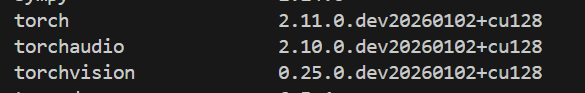

# 三视频拼接系统使用指南

> 基于UDIS2深度学习框架，通过两次拼接实现3个视频的自动拼接（input4+input3 → 再与input2拼接）

## 环境要求
- **GPU**: NVIDIA GPU (CUDA 12.8，测试配置: RTX 5070Ti)
- **Python**: 3.8+
- **依赖**: PyTorch, OpenCV, NumPy
- **系统**：Ubuntu 24.04 (用Windows会报错，原因是使用了不兼容的路径格式)

## 快速安装
```bash
# 创建环境
conda create -n video_stitch python=3.8.5
conda activate video_stitch

# 安装PyTorch (CUDA 12.8)
pip install torch torchvision torchaudio --index-url https://download.pytorch.org/whl/cu128

# 安装其他依赖
pip install opencv-python-headless numpy imageio pillow

#复制仓库
git clone https://github.com/nie-lang/UDIS2.git

#解压我的压缩包
将压缩包内文件和 UNIS2 放在同一目录下
```

## 模型下载
下载预训练模型并放入对应目录：
- Warp模型: [Baidu Cloud](https://pan.baidu.com/s/1Fx6YnQi9B2wvP_TOVAaBEA) → `UDIS2/Warp/model/epoch100_model.pth`
- Composition模型: [Baidu Cloud](https://pan.baidu.com/s/1qCGegzvxtzri6GiG7mNw6g) → `UDIS2/Composition/model/epoch050_model.pth`

## 使用步骤

### 步骤0: 准备视频
将4个需要拼接的视频放入 `input/` 目录：
- `input/2.mp4` - 右侧视频
- `input/3.mp4` - 中间视频  
- `input/4.mp4` - 左侧视频
- （算力有限我没使用第四个视频）

### 步骤1: 视频转帧
```bash
python video_to_frames.py
```
**说明**: 将视频转换为512x512的图片帧，保存到 `data/video_frames/input2/`, `input3/`, `input4/`

**输出**: 每个视频对应一个文件夹，包含 `000001.jpg`, `000002.jpg`, ... 格式的图片

### 步骤2: Warp拼接 input4+input3
```bash
python test_output_batch.py --test_path ./data/video_frames/ --input1_name input4 --input2_name input3 --output_path ./data/output/step1_43_warp/ --gpu 0 --batch_size 100
```

**参数说明**:
- `--test_path`: 输入帧的父目录
- `--input1_name`: 第一个输入文件夹名（左侧图像）
- `--input2_name`: 第二个输入文件夹名（右侧图像）
- `--output_path`: 输出目录
- `--batch_size`: 每批处理的图片数量（避免显存溢出）

**输出**: `data/output/step1_43_warp/` 包含 `warp1/`, `warp2/`, `mask1/`, `mask2/`, `ave_fusion/`

### 步骤3: 深度学习合成 input4+input3
```bash
python demo.py --input_folder ./data/output/step1_43_warp/ --output_folder ./data/output/step1_43_comp/ --output_name video_43.mp4 --fps 30 --gpu 0 --save_frames --no_video
```

**参数说明**:
- `--input_folder`: Warp输出的目录（包含warp1/, warp2/, mask1/, mask2/）
- `--save_frames`: 保存合成的图片帧
- `--no_video`: 不生成视频（避免编码问题），后续手动生成

**输出**: `data/output/step1_43_comp/composition_000001.jpg`, `composition_000002.jpg`, ...

### 步骤4: 准备二次拼接数据
```bash
python prepare_second_stitch.py --source1 ./data/output/step1_43_comp/ --source2 ./data/video_frames/input2/ --target_path ./data/prepared/prepared_432/ --folder1_name left43 --folder2_name right2
```

**说明**: 将第一次拼接的结果和input2的帧复制到新文件夹，重命名为统一格式（000001.jpg, 000002.jpg...），方便第二次拼接

**输出**: `data/prepared/prepared_432/left43/` 和 `right2/`

### 步骤5: Warp拼接 (4+3)+2
```bash
python test_output_batch.py --test_path ./data/prepared/prepared_432/ --input1_name left43 --input2_name right2 --output_path ./data/output/step2_432_warp/ --gpu 0 --batch_size 100
```

**输出**: `data/output/step2_432_warp/` 包含第二次Warp的结果

### 步骤6: 深度学习合成 (4+3)+2
```bash
python demo.py --input_folder ./data/output/step2_432_warp/ --output_folder ./data/results/final_432_composition/ --output_name final_video_432.mp4 --fps 30 --gpu 0 --save_frames --no_video
```

**输出**: `data/results/final_432_composition/composition_000001.jpg`, ...

### 步骤7: 生成最终视频
```bash
python create_video_from_frames.py ./data/results/final_432_composition/ ./data/results/final_432_composition/final_video_432.mp4 --fps 30
```

**输出**: `data/results/final_432_composition/final_video_432.mp4` - **最终拼接视频**


## 说明

- **拼接顺序**: 先拼接 input4(左) + input3(右) = 中间结果，再拼接 中间结果(左) + input2(右)
- **分辨率**: 图片会resize到512x512进行处理（显存限制，256x256仍会爆显存）
- **批处理**: 使用 `test_output_batch.py` 避免一次性加载所有图片导致显存溢出
- **输出位置**: 最终视频在 `data/results/final_432_composition/final_video_432.mp4`

---

**测试环境**: Linux + RTX 5070Ti + CUDA 12.8 | **日期**: 2026年1月10日

**注**： 我在验证过程中发现torch + cuda12.8不知道为什么装下来，所以拍摄了演示视频，但是我之前是可以装的
